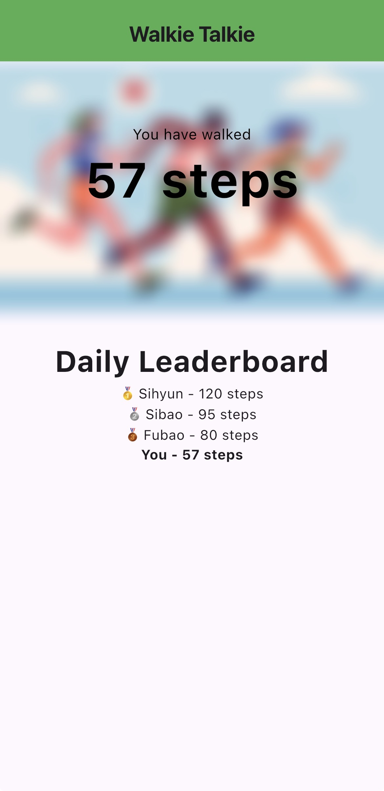

# Walkie Talkie

Walkie Talkie is a simple and efficient Flutter application that transforms your smartphone into a pedometer.

## Features

- Pedometer
- Leaderboard

## Screenshots



## Getting Started

These instructions will help you set up and run the WalkieTalkie app on your device.

### Prerequisites

- Flutter SDK installed on your development machine
- An iOS device or emulator

### Installation

1. Clone the repository:
   ```
   git clone https://github.com/noonx/walkietalkie.git
   ```
2. Navigate to the project directory:
   ```
   cd walkietalkie
   ```
3. Install dependencies:
   ```
   flutter pub get
   ```
4. Run the app:
   ```
   flutter run
   ```

## Permissions

The app requires the following permissions:

- **Health Data Access:** To count your steps

Please ensure you grant these permissions for the app to function correctly.

## Project Structure

```
/lib
  └── main.dart        # Entry point of the application
/assets
  └── images           # App images
```

## Author

Developed by [noonx]

GitHub: [https://github.com/noonx](https://github.com/noonx)  
Contact: jjaewoo27@aischennai.org
